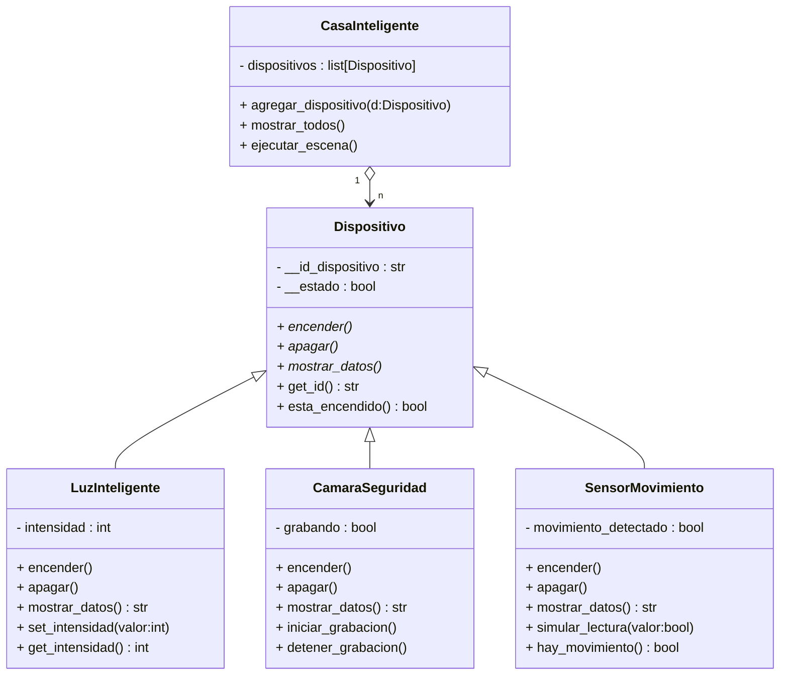

# Casa Inteligente — Práctica 3
Este proyecto implementa una casa inteligente usando la programación orientada a objetos en python, con una clase abstracta y tres subclases concretas. Incluye una clase de composición que gestiona una lista de dispositivos y ejecuta una escena automáctica 
---

## Estructura de clases 



### Ejemplo de uso (flujo esperado)

1. **Instanciar** dispositivos:
   - 2 luces con intensidades diferentes.
   - 1–2 cámaras.
   - 2 sensores de movimiento.
2. **Agregarlos** a `CasaInteligente` con `agregar_dispositivo()`.
3. **Encender** los dispositivos o dejarlos en espera.
4. **Simular lecturas** (e.g., `sensor.simular_lectura(True)`).
5. **Ejecutar escena**: si algún sensor detecta movimiento → encender luces y activar cámaras.
6. **Mostrar estado** con `mostrar_todos()`.

### Salida esperada
```
[Casa] Dispositivo agregado: Luz L1
[Casa] Dispositivo agregado: Camara C1
[Casa] Dispositivo agregado: Sensor S1
[Sensor S1] Movimiento: Sí
[Casa] Escena: movimiento detectado → encendiendo luces y cámaras...
[Luz L1] Encendida (intensidad 80%)
[Camara C1] Encendida (grabando: Sí)
--- Estado actual ---
LuzInteligente(id=L1, encendida=True, intensidad=80)
CamaraSeguridad(id=C1, encendida=True, grabando=True)
SensorMovimiento(id=S1, encendida=True, movimiento_detectado=True)
```
